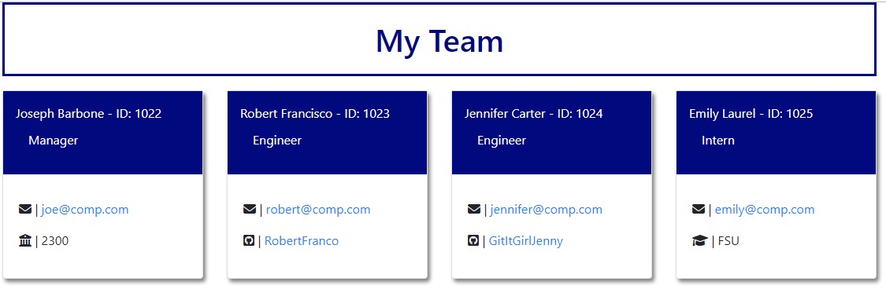
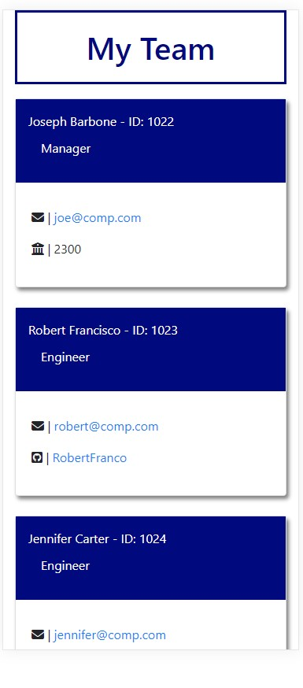
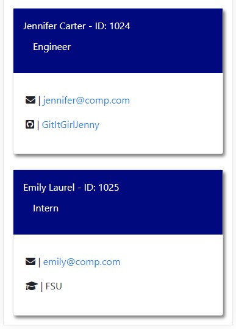

# Challenge Week 10 - Team Profile Generator

## User Story
AS A manager  
I WANT to generate a webpage that displays my team's basic info  
SO THAT I have quick access to their emails and GitHub profiles  

## Acceptance Criteria
GIVEN a command-line application that accepts user input  
WHEN I am prompted for my team members and their information  
THEN an HTML file is generated that displays a nicely formatted team roster based on user input  
WHEN I click on an email address in the HTML  
THEN my default email program opens and populates the TO field of the email with the address  
WHEN I click on the GitHub username  
THEN that GitHub profile opens in a new tab  
WHEN I start the application  
THEN I am prompted to enter the team manager’s name, employee ID, email address, and office number  
WHEN I enter the team manager’s name, employee ID, email address, and office number  
THEN I am presented with a menu with the option to add an engineer or an intern or to finish building my team  
WHEN I select the engineer option  
THEN I am prompted to enter the engineer’s name, ID, email, and GitHub username, and I am taken back to the menu  
WHEN I select the intern option  
THEN I am prompted to enter the intern’s name, ID, email, and school, and I am taken back to the menu  
WHEN I decide to finish building my team  
THEN I exit the application, and the HTML is generated  

## Screenshots
Screenshot main desktop

Screenshot main mobile  
  

Screenshot page two mobile  

## Summary/Languages
  

  

 

## Acknowledgements
Concept provided by UCF/2U Educational Services.  
Programming performed by Joseph Barbone.  